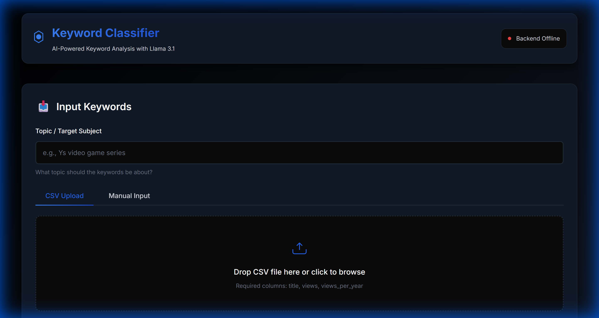
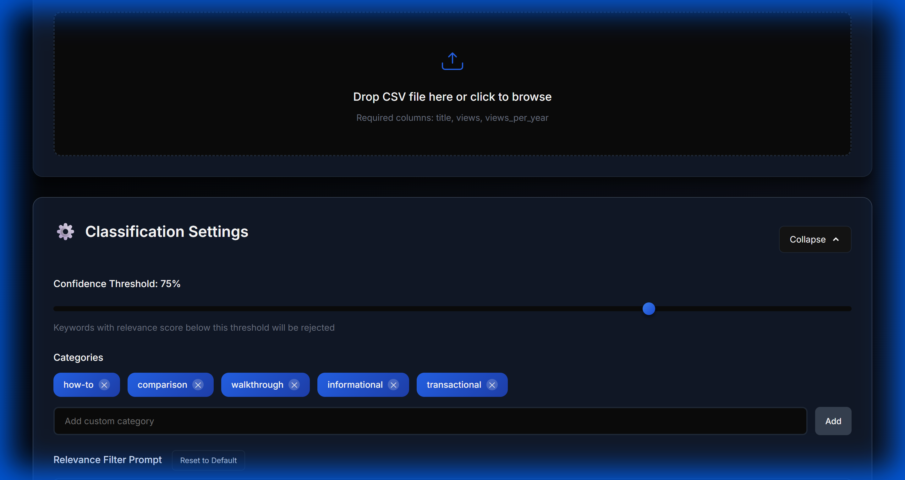
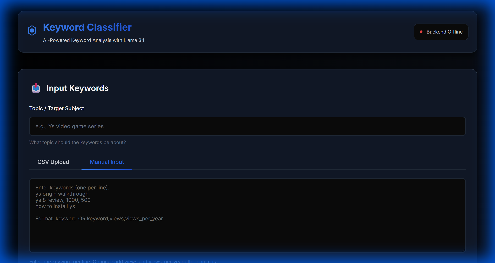

# 🔍 Intent Fucker - AI-Powered Keyword Classifier

> **Filter the bullshit. Classify with precision.**

An intelligent keyword classification system powered by Llama 3.1 that separates relevant keywords from noise and categorizes them by search intent.



## 🎯 What It Does

Got a massive list of keywords but half of them are irrelevant? This tool uses local AI (Llama 3.1 via Ollama) to:

1. **Filter Relevance**: Remove keywords that don't match your target topic
2. **Classify Intent**: Categorize keywords into search intent types (how-to, comparison, walkthrough, etc.)
3. **Export Clean Data**: Get two CSVs - accepted keywords and rejected ones

Perfect for:
- 🎬 **YouTube Keyword Research**: Filter out unrelated search terms
- 📊 **SEO Analysis**: Clean up keyword lists for content planning
- 🔬 **Search Intent Research**: Understand what users are actually looking for
- 📈 **Content Strategy**: Categorize keywords for targeted content creation

## ✨ Features

- 🤖 **Local AI Processing**: Uses Llama 3.1 8B via Ollama - your data stays private
- 📁 **Flexible Input**: Upload CSV files or paste keywords directly
- ⚙️ **Fully Customizable**: 
  - Adjust confidence thresholds
  - Create custom categories
  - Edit AI prompts to match your needs
- 📊 **Real-Time Progress**: Watch as keywords are analyzed with live progress tracking
- 💾 **Dual CSV Export**: Separate files for accepted and rejected keywords
- 🎨 **Beautiful UI**: Professional blue/black/grey theme with smooth animations



## 🚀 Quick Start

### Prerequisites

1. **Python 3.8+**
2. **Ollama** - [Download here](https://ollama.ai/download)

### Installation

1. **Clone the repository**:
   ```bash
   git clone https://github.com/konradschrein-star/intent-fucker.git
   cd intent-fucker
   ```

2. **Install Ollama and pull the model**:
   ```bash
   ollama pull llama3.1:8b
   ```

3. **Install Python dependencies**:
   ```bash
   cd backend
   pip install -r requirements.txt
   ```

### Running the App

1. **Start Ollama** (if not auto-running):
   ```bash
   ollama serve
   ```

2. **Start the backend** (in a new terminal):
   ```bash
   cd backend
   python app.py
   ```
   Backend runs on `http://localhost:5000`

3. **Open the frontend**:
   - Simply open `frontend/index.html` in your browser
   - OR run a local server:
     ```bash
     cd frontend
     python -m http.server 8000
     ```
     Then visit `http://localhost:8000`

## 📖 Usage

1. **Enter Your Topic**: What should the keywords be about? (e.g., "Ys video game series")

2. **Input Keywords**:
   - **CSV Upload**: Drag and drop a file with columns: `title`, `views`, `views_per_year`
   - **Manual Entry**: Paste keywords one per line



3. **Configure Settings** (optional):
   - Set confidence threshold (default: 75%)
   - Add/remove categories
   - Customize AI prompts

4. **Start Classification**: Click the big blue button and watch the magic happen ✨

5. **Download Results**:
   - `accepted_keywords_[timestamp].csv` - The good stuff
   - `rejected_keywords_[timestamp].csv` - The filtered out junk

## 📊 CSV Format

### Input CSV Example
```csv
title,views,views_per_year
ys origin walkthrough,1500,750
ys 8 gameplay,2000,1000
yes button tutorial,500,250
```

### Output Adds These Columns
- `relevance_score` - AI confidence score (0-100)
- `relevance_accepted` - True/False
- `category` - how-to, comparison, walkthrough, etc.
- `category_confidence` - Category confidence score
- `reason` - Why the AI made this decision

## 🎨 Default Categories

- **how-to**: Tutorials and instructional content
- **comparison**: "X vs Y", "best", comparison queries
- **walkthrough**: Step-by-step guides
- **informational**: "What is", definitions, general info
- **transactional**: "Download", "buy", action-oriented

*Add your own categories through the UI!*

## 🛠️ Tech Stack

- **Backend**: Python, Flask, Pandas
- **Frontend**: Vanilla HTML/CSS/JS (no bloat!)
- **AI**: Llama 3.1 8B via Ollama
- **Design**: Custom blue/black/grey theme with smooth animations

## 📁 Project Structure

```
intent-fucker/
├── backend/
│   ├── app.py              # Flask API server
│   ├── ollama_client.py    # Ollama integration
│   ├── classifier.py       # Classification logic
│   ├── csv_processor.py    # CSV handling
│   └── config.py          # Settings & prompts
├── frontend/
│   ├── index.html         # UI
│   ├── styles.css         # Styling
│   └── app.js             # Frontend logic
├── screenshots/           # UI screenshots
├── sample_keywords.csv    # Test data
├── QUICK_START.md        # Detailed setup guide
└── README.md             # This file
```

## 🧪 Test It Out

Use the included `sample_keywords.csv` to test the classifier:
- Mix of relevant keywords (Ys game series)
- Irrelevant noise (yes/no, HTML tutorials)
- Different intent categories

Perfect for seeing how the AI filters and categorizes!

## 🔧 Advanced Configuration

Edit `backend/config.py` to customize:
- Default prompts
- Confidence thresholds
- Categories
- Model selection
- API settings

You can also edit prompts directly in the UI!

## 📝 API Endpoints

- `GET /api/health` - Check Ollama status
- `POST /api/upload` - Upload CSV
- `POST /api/process` - Start classification
- `GET /api/progress/<job_id>` - Poll job progress
- `GET /api/results/<job_id>` - Get results
- `GET /api/download/<filename>` - Download CSV

## 🎯 Why "Intent Fucker"?

Because it ruthlessly destroys irrelevant keywords and forces precision on messy search data. No mercy for ambiguous intent. 😎

## 📄 License

MIT License - Do whatever you want with it!

## 🤝 Contributing

Found a bug? Want to add features? PRs welcome!

## ⚠️ Notes

- First run will download the Llama 3.1 model (~4.7GB)
- Processing speed: ~2-5 seconds per keyword (depends on your hardware)
- Works completely offline after initial setup
- Your data never leaves your machine

---

**Built with ❤️ and a lot of coffee** ☕

*Stop wasting time on irrelevant keywords. Let AI do the dirty work.*
